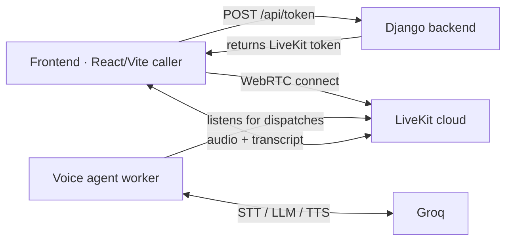
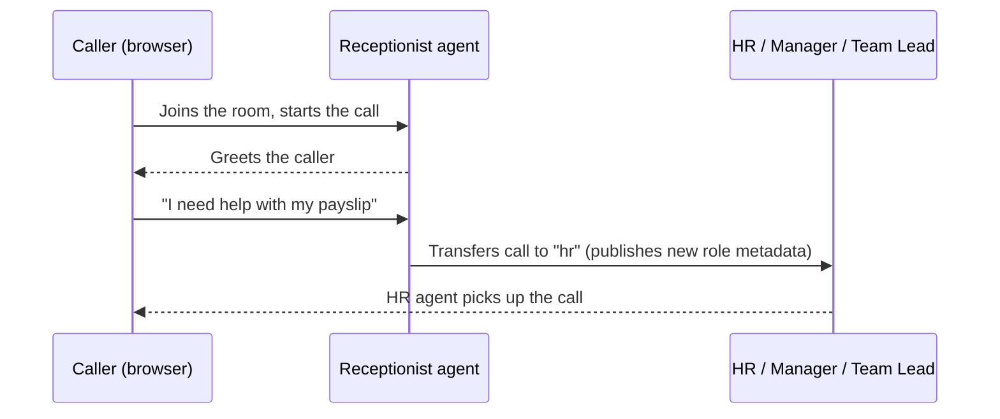

# livekit-voice-agent

A support line that answers with a voice agent: a receptionist greets callers and
transfers them to HR, the manager, or the team lead. Built to learn the
[LiveKit Agents](https://docs.livekit.io/agents/) framework (voice agents using
Groq for STT/LLM/TTS). Work in progress.

## How it works

The web app connects to a LiveKit room, a worker agent joins, and the caller
talks to an AI receptionist. If the caller needs someone specific, the agent
transfers the call to that role.





## Repo layout

```
livekit-voice-agent/
├── livekit/     # Voice agent worker(s)
├── backend/     # Django + DRF (async) API
└── frontend/    # Vite + React web caller
```

The agent package (`livekit/src/livekit_voice_agent/`) is split by concern:

- `multi_agent.py` — composition root: worker server + RTC entrypoint wiring.
- `prompts.py` — role instructions (receptionist / HR / manager / team lead).
- `session.py` — shared `SessionState`.
- `roles.py` — `CompanyAgent`, transfer tools (single DRY implementation),
  and the per-role tool allow-list.
- `transcript_relay.py` — publishes the caller's STT to the room so the web
  UI can show a full transcript.

`backend/` mints caller tokens and lists rooms; `frontend/` is the browser
caller (live waveform, current-agent indicator, end-of-call transcript).

The repo-root `.env` holds the shared credentials (`LIVEKIT_*`, `GROQ_API_KEY`);
each layer reads it.

## Run it

1. Start the voice agent worker (registers to your LiveKit cloud project and
   picks up call dispatches):

   ```
   cd livekit
   uv sync
   uv run python -m livekit_voice_agent.multi_agent dev
   ```

2. Start the backend:

   ```
   cd backend
   uv sync
   uv run uvicorn config.asgi:application --port 8000
   ```

   Endpoints:

   - `POST /api/token` — body `{"identity": "name"}`, returns
     `{token, url, room, identity}`. The worker's automatic dispatch joins the
     agent to the room when the caller connects.
   - `GET /api/rooms` — lists active rooms and participant counts.

3. Start the frontend:

   ```
   cd frontend
   npm install
   npm run dev   # http://localhost:5173, proxies /api to :8000
   ```

   Click **Start call** (mic permission), and the receptionist greets you.